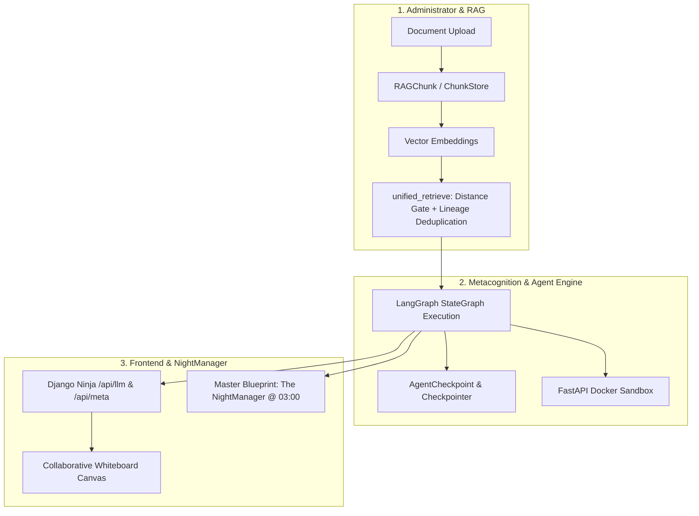
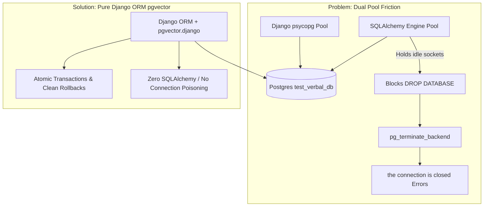
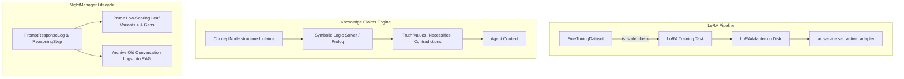

# Workstream 10: Major Architectural Audit & Modernization Plan

## 1. Executive Summary

Over six months of iterative engineering, Verbal has evolved from individual proof-of-concepts into a database-driven cognitive assistant for computational study design. The system integrates:
- **`background_resources`**: Multi-tier document ingestion and RAG chunking.
- **`grips`**: An operational knowledge graph and wiki with structured ontological claims.
- **`metacognition`**: Database-driven LangGraph state machines with variant speciation and AST-audited sandboxed code execution.
- **`llm_api`**: Multi-backend LLM inference proxy (PyTorch, vLLM, Ollama, OpenAI) with Outlines grammar constraints and branching conversation trees.
- **`benchmarking`**: Empirical evaluation framework with statistical parameter grid searches.

This document synthesizes an in-depth audit from three operational perspectives (**The Administrator**, **The Frontend Builder**, and **The NightManager**), diagnoses testing and connection lifecycle pathologies, and establishes a prioritized task roadmap.

---

## 2. Three Operational Perspectives

### Perspective 1: The Administrator
* **Scope:** Document storage maintenance, knowledge graph integrity, retrieval reliability, metacognition value, memory/connection leaks, latency, and correctness under load.
* **Key Observations:**
  1. **Dual Connection Pool Bottleneck:** The use of `langchain-postgres` introduces an independent SQLAlchemy connection pool alongside Django's `psycopg` connection pool. This creates process lock contention, blocks test database teardown, and causes socket disconnection cascades.
  2. **Storage Synchronization:** Document chunking status ([Document.currently_indexed](file:///home/crank/coding/antigrav/verbal/background_resources/models.py#L52)) is not consistently set to `True` during Celery ingestion, forcing UI views to use fallback existence checks.
  3. **Retrieval Pipeline Strengths:** [unified_retrieve](file:///home/crank/coding/antigrav/verbal/background_resources/retrieval.py#L32-L130) provides strong defenses against noise: distance gating (`max_distance <= 1.5`), token lemmatization overlap with length penalties, and lineage deduplication (suppressing raw RAG chunks when their parent [ConceptNode](file:///home/crank/coding/antigrav/verbal/grips/models.py#L38-L95) is also retrieved).
  4. **Synchronous Web Thread Blocking:** [send_message](file:///home/crank/coding/antigrav/verbal/demo_ui/views.py#L131-L176) executes multi-step blueprints synchronously in the web request thread, risking HTTP gateway timeouts on multi-step reasoning chains.

### Perspective 2: The Frontend Builder (Collaborative Whiteboarding Tool)
* **Scope:** Multi-user experiment design discussions, interactive brainstorming canvas, semantic clustering, naming groups of concepts, recalling past benchmark trials, and real-time state synchronization.
* **Key Observations:**
  1. **Monolithic JSON vs. Real-Time Streaming:** Current endpoints ([generate_response](file:///home/crank/coding/antigrav/verbal/llm_api/api.py#L33-L119) and [execute_blueprint](file:///home/crank/coding/antigrav/verbal/metacognition/api.py#L24-L65)) return only after full multi-turn completion. Collaborative whiteboards require Server-Sent Events (SSE) or WebSockets to stream node-by-node execution traces (`internal_monologue`), intermediate tool outputs, and token chunks.
  2. **Single-User Ownership Lock:** [Conversation](file:///home/crank/coding/antigrav/verbal/llm_api/models.py#L54-L74) is locked to a single `user_id` ([api.py:L41-L43](file:///home/crank/coding/antigrav/verbal/llm_api/api.py#L41-L43)), preventing multi-user canvas sessions.
  3. **Untapped Structured Schemas:** Rich backend Pydantic models ([Factor](file:///home/crank/coding/antigrav/verbal/llm_api/api.py#L188-L191), [StateSet](file:///home/crank/coding/antigrav/verbal/llm_api/api.py#L185-L187), [ConceptExtraction](file:///home/crank/coding/antigrav/verbal/metacognition/actions.py#L676-L684)) lack direct REST/Ninja endpoints for canvas actions like *"cluster these 10 sticky notes and name them"* or *"convert this whiteboard group into a Grips ConceptNode"*.
  4. **Branching Timelines & Git Commits:** The tree structure in [PromptResponseLog](file:///home/crank/coding/antigrav/verbal/llm_api/models.py#L279-L338) (`parent_log`) paired with physical Git workspace rewinds ([metacognition/api.py:L34-L51](file:///home/crank/coding/antigrav/verbal/metacognition/api.py#L34-L51)) provides a solid foundation for branching "alternate realities" on the canvas.

### Perspective 3: The NightManager
* **Scope:** Autonomous overnight reviewer of system performance, self-understanding through benchmarking, prompt speciation and variant evolution, knowledge graph curation, and database maintenance.
* **Key Observations:**
  1. **Master-SubBlueprint Orchestration:** [seed.py](file:///home/crank/coding/antigrav/verbal/metacognition/seed.py#L740-L770) wires `The NightManager` master blueprint to cleanly execute sub-blueprints (`NM_Housekeeping`, `NM_Deep_system_evaluation`, `NM_Optimize_Reasoning`, `NM_Refine_RAG_Grips`, `NM_Formulate_Benchmarks`) while reusing stable conversations (`NightManager: <BlueprintName>`).
  2. **Unbounded Variant Tree Growth:** While [ReasoningStep.create_variant()](file:///home/crank/coding/antigrav/verbal/metacognition/models.py#L245-L266) creates non-canonical variants and [task_update_performance_scores](file:///home/crank/coding/antigrav/verbal/metacognition/tasks.py#L183-L212) calculates EWMA performance scores, there is no automated pruning routine for underperforming variants deeper than 3–4 generations.
  3. **Disabled Dynamic Tool Governance:** [manage_dynamic_tools](file:///home/crank/coding/antigrav/verbal/metacognition/meta_tools.py#L542-L606) was disabled due to security risks. Re-enabling it requires wiring `requires_approval = True` human-in-the-loop pauses in [compiler.py](file:///home/crank/coding/antigrav/verbal/metacognition/compiler.py).

---

## 3. Deep Diagnosis: Testing, Connections & Vector Storage

### The SQLAlchemy vs. Django ORM Pathology
SQLAlchemy was introduced solely as a transitive requirement of LangChain's `langchain-postgres` package. This architecture creates several compounding issues:
1. **Uncoordinated Connection Pools:** SQLAlchemy manages its own connection pool outside Django’s connection manager, keeping connections open after request lifecycles.
2. **Transaction Isolation Failures:** SQLAlchemy writes bypass Django’s `TestCase` atomic transaction rollbacks, causing vector data to persist across test boundaries.
3. **Database Drop Blockades:** During test teardown, PostgreSQL refuses to drop `test_verbal_db` because SQLAlchemy sockets remain active.
4. **Socket Poisoning Workaround:** [`ForceTeardownTestRunner`](file:///home/crank/coding/antigrav/verbal/verbal/test_runner.py#L7-L26) executes `pg_terminate_backend(pid)` to force-kill connections. This severs Django's active sockets, causing subsequent test methods (like `test_django_shell_script_safe`) to crash with `psycopg.OperationalError: the connection is closed`.

### The Resolution: Native `pgvector.django`
Replacing `langchain-postgres` + `SQLAlchemy` with native `pgvector.django` (already present in the environment as `pgvector==0.3.6`) provides significant improvements:
- **Zero SQLAlchemy Dependency:** Completely eliminates `sqlalchemy` and `langchain-postgres`.
- **Single Connection Pool:** All queries use Django’s standard database connection pool.
- **Atomic Vector Transactions:** Vectors live directly on [RAGChunk](file:///home/crank/coding/antigrav/verbal/background_resources/models.py#L140) (`embedding = VectorField(dimensions=384)`) and [ConceptNode](file:///home/crank/coding/antigrav/verbal/grips/models.py#L38). Deletions and rollbacks are 100% atomic.
- **Elimination of Teardown Workarounds:** `ForceTeardownTestRunner` and `pg_terminate_backend` are no longer needed.
- **Idiomatic Vector Search:** Vector distance filtering and HNSW indexing are performed directly via Django QuerySets (`CosineDistance("embedding", query_vector)`).

---

## 4. The Four Testing & Evaluation Tiers

| Tier | Purpose | Vulnerability / Failure Mode | Target Architecture |
| :--- | :--- | :--- | :--- |
| **Tier 1: Mocked Django Unit Tests** | Fast validation of database schemas, API contracts, permissions, and routing. | Can pass 100% while actual vector search or LLM generation is completely broken. | Pure mocked tests running in <15s with zero network or VRAM dependencies. |
| **Tier 2: E2E Live Stack Tests (`@tag('e2e')`)** | Validates full pipeline: HTTP -> Django Ninja -> LangGraph -> Outlines/vLLM/Ollama -> Sandbox. | Causes database connection resets, port collisions, and VRAM OOM when run mixed with unit tests. | Isolated into a dedicated `run_e2e_tests.sh` suite excluded from standard unit test runs. |
| **Tier 3: Doctest Characterization Trials (`.rst`)** | Executable living documentation capturing cognitive failure modes and execution traces. | Weak assertions (e.g. `1 if final_str else 0`) pass even when the model returns error messages. | Upgrade assertions to verify actual reasoning steps, sandbox return codes, and AST validity. |
| **Tier 4: Empirical Benchmarking (`benchmarking`)** | Statistical evaluation of RAG retrieval strategies across parameter grids ([Investigation.to_dataframe()](file:///home/crank/coding/antigrav/verbal/benchmarking/models.py#L73-L98)). | Untuned local LLM judges without Outlines constraints hallucinate scores or output invalid text. | Enforce Outlines JSON schemas for all judge outputs (`faithfulness_score`, `relevance_score`). |

---

## 5. Prioritized Task Matrix

### Level 1: Urgent Bugs, Missed Opportunities & Architectural Cleanup

*Critical fixes for runtime errors, connection poisoning, security stubs, and blocking operations.*

1. **Migrate Vector Storage to Pure `pgvector.django` (Eliminate SQLAlchemy)**
   - *Rationale:* Eliminates dual connection pools, socket dropouts (`the connection is closed`), and the need for `pg_terminate_backend`.
   - *Implementation:*
     - Add `VectorField(dimensions=384, null=True, blank=True)` to [`RAGChunk`](file:///home/crank/coding/antigrav/verbal/background_resources/models.py#L140) and [`ConceptNode`](file:///home/crank/coding/antigrav/verbal/grips/models.py#L38).
     - Add `HnswIndex` to both models for cosine distance search.
     - Refactor [RAGService](file:///home/crank/coding/antigrav/verbal/background_resources/rag_service.py) and [GripsService](file:///home/crank/coding/antigrav/verbal/grips/services.py) to query via Django ORM `annotate(distance=CosineDistance(...))` instead of `langchain_postgres.PGVector`.
     - Remove `create_engine`, `engine.dispose()`, `disconnect()` routines, and `sqlalchemy` imports.
   - status [Completed]

2. **Fix Pytest Package Collection Error**
   - *Rationale:* Resolves `ModuleNotFoundError: No module named 'commands.sync_architecture'`.
   - *Implementation:* Create empty `metacognition/management/__init__.py` so Python's module loader properly resolves the package hierarchy during recursive doctest discovery.
   - status [Completed]

3. **Prevent Database Socket Poisoning in `django_shell_script`**
   - *Rationale:* Ensures scripts executed by agents or tests don't fail on severed connections.
   - *Implementation:* Add `connection.ensure_connection()` in [django_shell_script](file:///home/crank/coding/antigrav/verbal/metacognition/meta_tools.py#L285-L332) before `exec()`.
   - status [Completed]

4. **Fix Inconsistent Document Indexing Flag (`currently_indexed`)**
   - *Rationale:* Background RAG ingestion leaves `Document.currently_indexed` as `False`, requiring UI fallback workarounds.
   - *Implementation:* Update [convert_chunk_store_document](file:///home/crank/coding/antigrav/verbal/background_resources/rag_service.py#L347-L488) and [convert_chunk_store_document_grobid](file:///home/crank/coding/antigrav/verbal/background_resources/rag_service.py#L489-L553) to set `document.currently_indexed = True` on successful commit.
   - status [Completed]

5. **Eliminate Web-Worker Blocking on Blueprint Execution**
   - *Rationale:* Multi-step agent loops executed synchronously in [send_message](file:///home/crank/coding/antigrav/verbal/demo_ui/views.py#L131-L176) block the web server process.
   - *Implementation:* Dispatch blueprint execution asynchronously via [task_run_blueprint_async](file:///home/crank/coding/antigrav/verbal/metacognition/tasks.py#L71-L75) with Datastar Server-Sent Events (SSE) streaming endpoint `/api/meta/stream_blueprint/` backed by Redis Pub/Sub events.
   - status [Completed]

6. **Secure Dynamic Tool Creation with Human-in-the-Loop Intercept**
   - *Rationale:* [manage_dynamic_tools](file:///home/crank/coding/antigrav/verbal/metacognition/meta_tools.py#L542-L606) was disabled due to safety concerns.
   - *Implementation:* Enforce `requires_approval = True` on all dynamic tools. In [compiler.py](file:///home/crank/coding/antigrav/verbal/metacognition/compiler.py#L461-L495), check `tool_def.requires_approval`; if true and unapproved, route execution to `USER_INPUT_REQUIRED` and pause the state graph at `interrupt_node`, streaming Datastar authorization fragments and resuming via `/api/meta/approve_tool/`.
   - status [Completed]

7. **Add Blueprint Stop/Interrupt Capability**
   - *Rationale:* Allows users or systems to manually halt runaway LangGraph loops.
   - *Implementation:* Check Redis cancellation flag (`verbal:cancel:{run_id}`) at the beginning of each `_make_action_node` cycle, with `/api/meta/cancel_blueprint/` endpoint and immediate Datastar UI patch.
   - status [Completed]

8. **Fix System Prompt Multiplication & Universal StateTree Snapshotting**
   - *Rationale:* Subsequent conversation turns duplicate system prompts in strict chat templates, and branch forks need clean DAG replay with immutable state_tree tracking.
   - *Implementation:* Standardize [Conversation.as_messages()](file:///home/crank/coding/antigrav/verbal/llm_api/models.py#L75-L184) to follow DAG leaf paths back to root without intermediate system prompt concatenation; snapshot `state_tree_snapshot` on every [PromptResponseLog](file:///home/crank/coding/antigrav/verbal/llm_api/models.py#L273); and add [ReasoningStep.include_state_tree](file:///home/crank/coding/antigrav/verbal/metacognition/models.py) with structured markdown formatting.
   - status [Completed]

9. **NightManager Diagnostic Performance Review Tooling & Management Command**
   - *Rationale:* Admins and self-reflecting agents need persistent quantitative tracking of session pass/fail rates, latency, state_tree health, and generated artifacts.
   - *Implementation:* Build `audit_nightmanager_performance` and `format_performance_report_markdown` in [metacognition/reporting.py](file:///home/crank/coding/antigrav/verbal/metacognition/reporting.py); add `inspect_nightmanager` management command and `inspect_nightmanager_performance` meta-tool for Phase 3 self-reflection.
   - status [Completed]

10. **Constrain Action Nodes with Structured Schemas & Real DB Object Persistence**
    - *Rationale:* Small models (e.g. Gemma-2B) fail unconstrained JSON syntax when attempting to propose prompt variants, grips concepts, or blueprints.
    - *Implementation:* Refactor `PromptVariant`, `GripsExpansionProposal`, and `CognitiveBlueprintProposal` schemas in [metacognition/actions.py](file:///home/crank/coding/antigrav/verbal/metacognition/actions.py) with automatic database persistence handlers in `compiler.py` (`ReasoningStep` variants with `is_pending_review=True`, `ConceptNode`, `CognitiveBlueprint`) and automatic state tree task resolution.
    - status [Completed]

11. **Bidirectional StateTree Propagation Across Sub-Blueprints & Prompt Instruction Cleanup**
    - *Rationale:* Child sub-blueprints operated in isolated conversations without synchronizing tasks or findings with parent blueprints, and prompt templates contained literal bracketed placeholders (`[Descriptive Task Name]`).
    - *Implementation:* Propagate parent `state_tree` to child sub-blueprints in `compiler.py` `_make_action_node`, merge child task updates/hypotheses/questions back via `_merge_state_trees`, and replace bracketed placeholders with concrete task paths in [metacognition/seed.py](file:///home/crank/coding/antigrav/verbal/metacognition/seed.py).
    - status [Completed]

---

### Level 2: Logic Cleanup (Clarifying Intention, Robustness & API Expressiveness)

*Refactoring that makes systems more coherent, extensible, and clean.*

1. **Build Streaming Endpoints (SSE) for Real-Time Canvas Collaboration**
   - *Rationale:* Whiteboarding tools require progressive token streaming and live state updates as agent steps complete.
   - *Implementation:* Add Django Ninja / ASGI streaming routes (`/api/whiteboard/stream_response/` and `/api/whiteboard/stream_session/{session_id}/`) yielding real-time Datastar SSE events backed by Redis Pub/Sub.
   - status [Completed]

2. **Generalize Multi-User Conversation & Workspace Sharing (Work Organisation App)**
   - *Rationale:* Enable multiple collaborators to participate in the same experiment session with clear group scoping and anonymity settings.
   - *Implementation:* Created `work_organisation` app with `Project` -> `Workshop` -> `WorkshopSession` hierarchy, `GroupScopedQuerySet` filtering against Django Groups, `ConversationMember` role management, and 4 anonymity/access modes (`RESTRICTED_TRACKED`, `RESTRICTED_ANONYMIZED_UI`, `RESTRICTED_ANONYMIZED_DB`, `PUBLIC_OPTIONAL_USER`).
   - status [Completed]

3. **Dedicated Whiteboard Idea Clustering & Factor Discovery Endpoints**
   - *Rationale:* Expose structured whiteboard card/cluster storage, AI idea clustering, causal factor discovery, and pastable export formatters for UI canvases.
   - *Implementation:* Built `WhiteboardCard`, `WhiteboardCluster`, `/api/whiteboard/cards/`, `/api/whiteboard/cluster_ideas/`, `/api/whiteboard/extract_causal_graph/`, and `/api/whiteboard/export_summary/{session_id}/`.
   - status [Completed]

4. **Workspace Janitor Re-use & Empty Workspace Handling**
   - *Rationale:* Prevent orphan directories during test trials.
   - *Implementation:* Enhance [system_janitor](file:///home/crank/coding/antigrav/verbal/metacognition/meta_tools.py#L333-L368) to recycle empty workspace directories and prune unreferenced workspace trees older than 7 days.

5. **Expose Interactive Graph Topology Endpoint for Canvas Rendering**
   - *Rationale:* The UI needs graph nodes, edge types (`DEPENDS_ON`, `INCLUDES`, `EXEMPLIFIES`), and claims formatted for visual layout engines (Cytoscape / D3 / React Flow).
   - *Implementation:* Add `/api/grips/graph_data/` supporting domain filtering, node neighborhood expansion, and edge justification tooltips.

6. **Tighten Doctest Assertions to Eliminate False Positives**
   - *Rationale:* Ensure characterization trials fail when models produce errors or hallucinations.
   - *Implementation:* Audit the 9 `.rst` trials in [`metacognition/metacognition_trials/`](file:///home/crank/coding/antigrav/verbal/metacognition/metacognition_trials/) to replace weak string checks (`1 if final_str else 0`) with domain-valid assertions (checking sandbox return codes, AST structure, and reasoning tokens).

7. **Isolate E2E Test Execution in Test Runners**
   - *Rationale:* Keep standard unit tests fast and deterministic while preserving live integration suites.
   - *Implementation:* Configure default `manage.py test` to exclude `@tag('e2e')` and provide a dedicated `test_e2e.sh` script that validates service health before execution.

---

### Level 3: Implied Tasks & Dormant Architectures

*Unfinished features where clear foundations and models exist in code awaiting full operationalization.*

1. **Operationalize the LoRA Training & Dynamic Loading Pipeline**
   - *Foundation:* [LoRAAdapter](file:///home/crank/coding/antigrav/verbal/llm_api/models.py#L351-L368), [FineTuningDataset](file:///home/crank/coding/antigrav/verbal/benchmarking/models.py#L31-L54), and `set_active_adapter()` in [ai_service.py:L223-L254](file:///home/crank/coding/antigrav/verbal/llm_api/ai_service.py#L223-L254) are modeled with staleness tracking ([20260804_unfinished_tasks.md](file:///home/crank/coding/antigrav/verbal/.agents/workstream_specs/notes/20260804_unfinished_tasks.md)).
   - *Goal:* Complete the Celery workflow that reads a `FineTuningDataset`, executes PEFT/LoRA fine-tuning for domain-specialized steps, and validates adapter execution during benchmark runs.

2. **Symbolic Claim Reasoning Engine (Prolog / Rule Engine Integration)**
   - *Foundation:* [ConceptNode.structured_claims](file:///home/crank/coding/antigrav/verbal/grips/models.py#L60-L65) uses an operational ontology (`REQUIRES`, `CAPABLE_OF`, `INCOMPATIBLE_WITH`, `HAS_PROPERTY`, `IS_A`, `PART_OF`) extracted via [ConceptExtraction](file:///home/crank/coding/antigrav/verbal/metacognition/actions.py#L670-L684).
   - *Goal:* Implement a symbolic evaluation service ([20260807_grips_testing_and_claims_computation.md](file:///home/crank/coding/antigrav/verbal/.agents/workstream_specs/notes/20260807_grips_testing_and_claims_computation.md)) that tests consistency, computes necessity/sufficiency chains, and feeds verified logical deductions back into the agent context.

3. **NightManager Variant Tree Pruning & Archival Routines**
   - *Foundation:* [ReasoningStep](file:///home/crank/coding/antigrav/verbal/metacognition/models.py#L159-L269) lineages track parents and EWMA performance scores ([20260806_nightmanager_pruning.md](file:///home/crank/coding/antigrav/verbal/.agents/workstream_specs/notes/20260806_nightmanager_pruning.md)).
   - *Goal:* Add an automated nightly routine to:
     - Prune underperforming `ReasoningStep` variant branches deeper than 3–4 generations.
     - Archive very old `PromptResponseLog` records.
     - Detect and flag zero-hit or redundant `RAGChunk` records.

4. **Conversation Logs as a Self-Learning RAG Source**
   - *Foundation:* [search_past_conversations](file:///home/crank/coding/antigrav/verbal/metacognition/meta_tools.py#L872-L893) implements PostgreSQL full-text search over previous prompt logs ([20260805_conversation_logs_rag.md](file:///home/crank/coding/antigrav/verbal/.agents/workstream_specs/notes/20260805_conversation_logs_rag.md)).
   - *Goal:* Ingest successful, high-rated conversation episodes as vector-indexed synthetic knowledge so the assistant learns institutional memory and past experiment designs across sessions.

5. **Automated Playwright UI Doctests with Visual Asset Capture**
   - *Foundation:* [BACKEND_AFFORDANCES.md](file:///home/crank/coding/antigrav/verbal/BACKEND_AFFORDANCES.md) maps affordance coverage, and [20260804_unfinished_tasks.md](file:///home/crank/coding/antigrav/verbal/.agents/workstream_specs/notes/20260804_unfinished_tasks.md) outlines UI doctest requirements.
   - *Goal:* Implement headless Playwright test runners that validate HTMX UI interactions and capture animated step-by-step demonstrations for documentation.