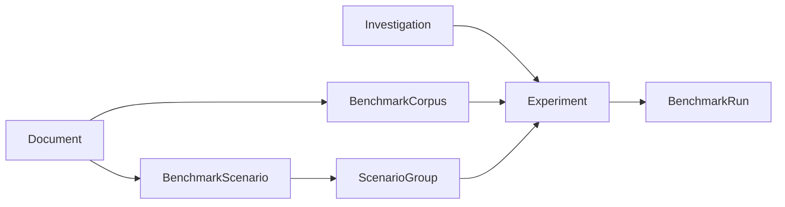
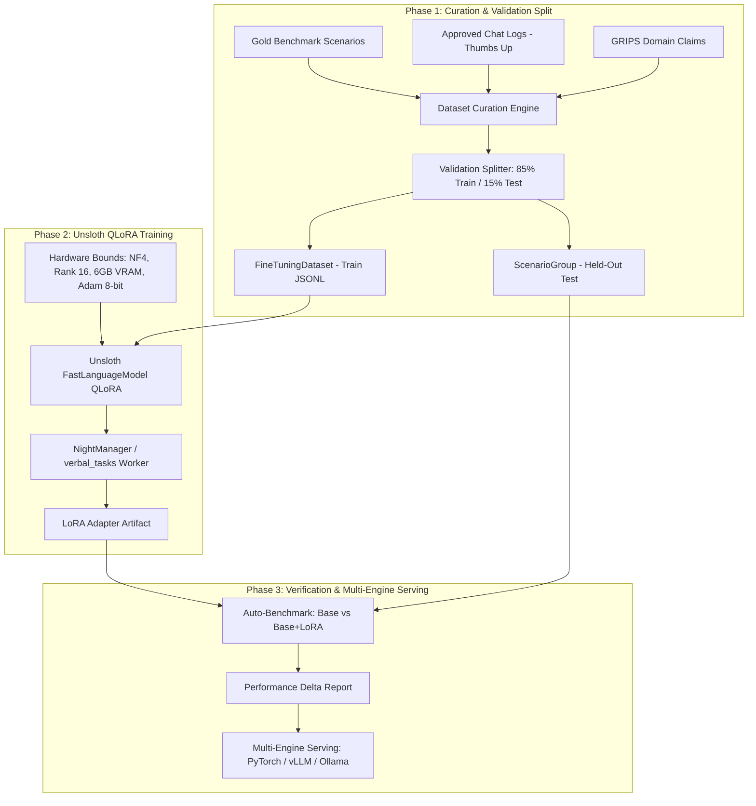

# WS18: Benchmarking Evolution & Unsloth Fine-Tuning Flywheel

## 1. Executive Summary

This workstream establishes the architectural evolution of the **Benchmarking** application and introduces a complete, closed-loop **Fine-Tuning Flywheel** powered by **Unsloth (QLoRA)**. 

While the existing benchmarking subsystem laid sound relational foundations (`BenchmarkCorpus`, `BenchmarkScenario`, `Investigation`, `Experiment`, `BenchmarkRun`), its day-to-day usability has been hindered by standard Django Admin constraints: a fragmented 5-hop model dependency chain, error-prone raw JSON configurations, synchronous browser-blocking actions, and tabular inline curation. Furthermore, automated scenario generation has been restricted to isolated single-document chunk strides, omitting cross-document synthesis and the rich domain knowledge already modeled in **GRIPS**.

This specification outlines a three-step transformation:
1. **Step 1: Dataset Curation Studio & Automatic Train/Validation Split**: A multi-source harvester mining gold benchmark scenarios, thumbs-up production chat logs (`PromptResponseLog`), and GRIPS causal claims. It introduces an automated train/test split (e.g., 85% train / 15% test) where the test split is automatically registered as a first-class `ScenarioGroup` for immediate post-training verification.
2. **Step 2: Consolidated Reactive UI (Benchmarking Studio)**: Moving benchmark setup, execution, and inspection out of raw Django Admin into a dedicated, reactive Benchmarking Studio powered by Datastar.
   - **Look-and-Feel Consolidation**: Unifies design tokens, typography, dark canvas rhythm (`--bg-canvas: #0b1120`, `--bg-surface: #131d33`, `--border-color: #334155`), and reactive SSE paradigms across Benchmarking, Wiki, Mindmap Workshop, and Demo UI.
   - **Domain Focus**: Strictly avoids functional or domain sprawl between interfaces—benchmarking and fine-tuning retain their own dedicated, uncluttered workflows.
   - **General Async Execution**: Benchmarking operations run as asynchronous, generator-backed tasks that yield real-time progress indicators (SSE) so daytime human users experience fluid, non-blocking responsiveness without browser freezes or HTTP 504 timeouts. (Overnight, the autonomous **NightManager** LLM blueprint can execute these same batch runs unhurriedly while the system is dedicated to maintenance).
3. **Step 3: Hardware-Aware Unsloth Training & Closed-Loop A/B Evaluation**: A robust 4-bit QLoRA training engine tailored for consumer/mobile GPUs (6.0 GB VRAM bounds, gradient checkpointing, 8-bit Adam, dynamic chat templates). Upon training completion, an automated A/B benchmark run (Base Model vs. Base + LoRA Adapter) evaluates domain specialization against general reasoning retention.

---

## 2. Critique & Architectural Diagnosis

### 2.1 The Django-Admin Friction Points

1. **The 5-Hop Relational Chain ("Spaghetti Navigation")**: Setting up an experiment requires jumping across five separate changelists. Modifying a scenario group or adding a document requires abandoning the `Experiment` form and navigating disconnected admin screens.
2. **The Raw JSON Configuration Trap**: Experiment parameters (`rag_strategy`, `chunk_size`, `hosting_backend`, `context_mode`) are manually typed into an unvalidated `JSONField`. Typos fail silently or default without immediate feedback.
3. **Tabular Inline Curation Bottleneck**: Technical Q&A pairs and ground-truth contexts span hundreds of words. Django Admin's `TabularInline` truncates text aggressively, preventing effective evaluation of formatting nuance or subtle hallucinations.
4. **Execution Model Mismatch**: Admin actions execute synchronously within the HTTP thread. Any benchmark larger than five scenarios risks HTTP 504 gateway timeouts. Benchmarking and dataset curation require async execution that streams incremental progress indications to the human operator. While the autonomous NightManager blueprint can run these tasks unhurriedly overnight, daytime human users need responsive progress telemetry.

### 2.2 Comparable Tooling & UI Suite Design
Rather than scattering ad-hoc widgets or isolating a single viewer, the Benchmarking Studio provides a cohesive suite of ten primary user input, composition, and inspection controls:
1. **Matrix Experiment Composer**: Declarative multi-axis selection (Model $\times$ Backend $\times$ RAG Strategy $\times$ ScenarioGroup) with instant parameter validation.
2. **Scenario & Gold Standard Browser**: Expansive cards for multi-turn prompts, ground-truth outputs, and context passages, free of admin truncation.
3. **Candidate vs. Gold Inspector & Diff Tool**: Side-by-side completion inspection with visual diffs and failure diagnostics.
4. **One-Click Gold Standard Promotion**: Direct promotion of high-performing model completions into gold benchmark scenarios or training candidates.
5. **Live Telemetry & Turn-by-Turn Progress Stream**: Real-time Datastar SSE widgets displaying live scenario execution, TTFT, and tokens/second.
6. **Scenario Generator Studio**: Visual controls for triggering Outlines-based synthetic generation from document corpora and GRIPS claims with chunk stride and difficulty adjustments.
7. **Dataset Curation & Split Controls**: Interactive sliders for thumbs-up rating thresholds, max token limits, train/val split ratios, and semantic deduplication.
8. **Evaluation Metric Rubric Selector**: Toggles for exact match, BLEU/ROUGE, latency percentiles, and LLM-as-a-judge rubrics.
9. **Fine-Tuning Parameter Tuner**: Interactive sliders for LoRA rank, alpha, learning rate, and epochs with instant VRAM budget estimation.
10. **A/B Leaderboard & Model Checkpoint Switcher**: Fast comparative table and delta charts comparing base model vs. LoRA adapter performance across validation scenario groups.

---

## 3. Evaluation of Documentation Scenario Generators (`generators.py`)

The current generator ([benchmarking/generators.py](file:///home/crank/coding/antigrav/verbal/benchmarking/generators.py)) uses Outlines schema-constrained decoding (`SyntheticQABatch`) and a two-stage judge (`ScenarioEvaluation`). However, it has key limitations:
1. **Single-Document Silo**: Processes one `Document` at a time. It cannot generate cross-document questions requiring synthesis between related research papers in a `BenchmarkCorpus`.
2. **Naive Chunk Stride**: Slices text by raw chunk index (`range(0, total_chunks, stride)`), creating context boundary cuts that sever multi-paragraph causal arguments.
3. **Absence of Adversarial / Hard Negatives**: Does not generate unanswerable/refusal questions to test hallucination resistance, nor does it generate plausible counterfactual distractors.
4. **No Multi-Turn Trajectories**: Only generates atomic single-turn Q&A. It cannot synthesize multi-turn context ladders.
5. **Omission of GRIPS Knowledge**: Ignores the structured concepts, claims, and causal relationships already parsed in `grips` (`ConceptNode`, `Domain`).

---

## 4. The Fine-Tuning Flywheel Architecture

---

## 5. Specification for Step 1: Dataset Curation Studio & Auto-Validation Split

### 5.1 Goals
1. Provide a programmatic and administrative service to harvest training pairs from three distinct sources:
   - **Source A**: Filtered, high-quality `BenchmarkScenario` objects.
   - **Source B**: Approved, high-signal production chat logs (`PromptResponseLog` with thumbs-up feedback).
   - **Source C**: Synthetic scenarios derived from `BenchmarkCorpus` documents and GRIPS claims.
2. Automate **Train/Validation Splitting**:
   - Generate a sanitized JSONL dataset in standard formats (`ShareGPT` for Unsloth/Axolotl, `OpenAI` format).
   - Automatically save the held-out validation split (e.g. 15%) as a new `ScenarioGroup` linked to the dataset.
3. Provide comprehensive dataset diagnostics:
   - Example count, total tokens, vocabulary coverage, and semantic diversity score (mean pairwise cosine distance).
   - Source currency tracking: automatically flags `is_stale = True` if source documents or scenarios are updated.

### 5.2 Module Architecture: `benchmarking/curation.py`
* `HarvestConfig`: Dataclass specifying sources, minimum feedback score, max tokens, train/val split ratio (default 0.85), and system prompt.
* `curate_fine_tuning_dataset(...)`: Core functional pipeline that:
  1. Aggregates candidate examples from requested sources.
  2. Deduplicates by semantic similarity and normalizes chat roles.
  3. Splits into train set and validation set using a deterministic seed.
  4. Writes the training set to disk in `datasets/`.
  5. Creates a `FineTuningDataset` database record with computed metrics.
  6. Creates a `ScenarioGroup` for the validation set, linking it to `FineTuningDataset.validation_group`.

### 5.3 Model Schema Updates in `benchmarking/models.py`
Add fields to `FineTuningDataset`:
* `validation_group`: ForeignKey to `ScenarioGroup` (`null=True, blank=True, on_delete=models.SET_NULL`).
* `split_ratio`: FloatField (default `0.85`, representing train fraction).
* `train_example_count`: IntegerField (default `0`).
* `val_example_count`: IntegerField (default `0`).
* `metadata`: JSONField (default `dict`, storing source distribution, filter criteria, and token percentiles).

---

## 6. Implementation Roadmap

| Phase | Description | Deliverables |
| :--- | :--- | :--- |
| **Step 1 (Immediate)** | Dataset Curation Studio & Auto-Validation Split | `benchmarking/curation.py`, model updates in `benchmarking/models.py`, admin integration, tests in `benchmarking/tests.py`. |
| **Step 2** | Consolidated Reactive UI (Benchmarking Studio) | Dedicated Datastar/SSE interface in web app sharing dark tokens/aesthetics, async progress streaming for browser responsiveness, and the 10-control suite (Matrix Composer, Gold Inspector, Telemetry, Curation). |
| **Step 3** | Robust Unsloth Training Harness & Closed-Loop Eval | Hardware-bounded `train_lora.py` (NF4, rank 16, 6GB limit, dynamic chat templates), auto A/B evaluation, multi-engine export (PyTorch/vLLM/Ollama). |

---

## 7. Verification & Testing Plan

1. **Unit Tests (`benchmarking/tests.py`)**:
   - Test data harvesting across `BenchmarkScenario`, `PromptResponseLog`, and synthetic document chunks.
   - Verify deterministic train/val split and automatic creation of the held-out `ScenarioGroup`.
   - Verify semantic diversity scoring and token count estimation.
   - Verify `is_stale` currency tracking when source scenarios or documents change.
2. **Doctests**:
   - Embed runnable doctests in `curate_fine_tuning_dataset` and metric calculation helpers.
3. **Code Quality**:
   - PEP 8 compliance verification via `/code-reviewer`.
