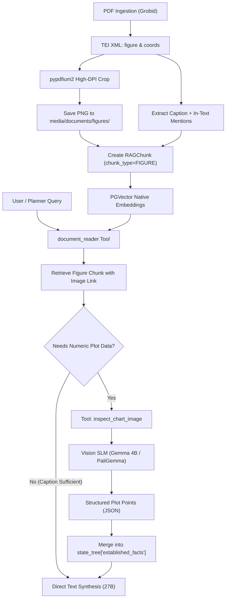

# WS19: Multimodal Visual Evidence, Figure Ingestion & Chart Reasoning

## Status: DRAFT
**Author**: Antigravity Assistant & Crank  
**Date**: 2026-10-04  
**Branch**: `feature/multimodal-visual-evidence`  
**Prerequisites**: WS17 (Layered Tool Governance), WS18 (Benchmarking Flywheel), Note 17 (RAG Anti-Hijacking), Note 19 (State Tree Lifecycle)

---

## 1. Executive Summary & Objective

In scientific literature and technical standards, the densest empirical data is frequently communicated through **charts, graphs, schematics, and tabular figures**, rather than prose. Currently, Verbal's RAG pipeline indexes text paragraphs and glossary definitions, rendering embedded figures invisible to retrieval and reasoning.

The objective of **Workstream 19** is to make scientific figures, graphs, and charts **first-class searchable and inspectable evidence** in Verbal:
1. **Automated Figure & Crop Extraction**: Parse `<figure>` definitions and page coordinates from Grobid TEI XML, rasterize high-DPI crops via `pypdfium2`, and store visual assets deterministically.
2. **Text-Proxy Semantic Indexing**: Index figure captions, labels, and in-text discussion paragraphs into the existing vector store as `RAGChunk` entities, making them instantly searchable without heavy visual transformer infrastructure.
3. **Multi-Scale Model Specialization**: Leverage the model spectrum:
   - **Gemma 27B**: High-level strategic reasoning, blueprint planning, and state-tree synthesis.
   - **Gemma 4B / Vision SLMs**: On-demand visual inspection tools (`inspect_chart_image`) extracting structured numeric tables and plot trends.
4. **Cognitive Blueprint Integration**: Equip blueprints with visual evidence extraction routines that ground numeric plot points directly into `state_tree["established_facts"]`.

---

## 2. Architectural Design & Core Decisions

### 2.1 The "Text-Proxy" Image Chunk Pattern
*Avoiding the ColPali / Full-Page VLM Trap:*  
Embedding every PDF page using vision transformers (ColPali/LayoutLM) requires massive GPU VRAM, slow indexing, and separate vector indexes. Instead, we recognize that academic authors **always annotate figures with labels, captions, and in-text narrative discussions**.

We represent figures in the database as:
- **`RAGChunk.text_content`**: The semantic search surface:
  ```text
  [Figure 4: FMCW Radar vs 3D LiDAR Ranging Error]
  Caption: Ranging error of 77-GHz FMCW radar and 3D LiDAR in dense particulate smoke aerosol as a function of temperature.
  Discussion Context: "As demonstrated in Figure 4, optical backscatter degrades LiDAR ranging beyond 150°C, whereas radar maintains sub-4cm accuracy up to 250°C."
  ```
- **`RAGChunk.chunk_type`**: Strongly-typed model field (`FIGURE`, `TABLE`, `TEXT`, `GLOSSARY`).
- **`RAGChunk.metadata`**: Multimodal asset link and spatial coordinates:
  ```json
  {
    "figure_label": "Figure 4",
    "image_path": "documents/figures/12_fig_4.png",
    "page_number": 6,
    "bounding_box": [120.5, 340.2, 450.0, 300.0],
    "document_id": 12,
    "section_title": "4. Experimental Validation"
  }
  ```

### 2.2 Model Spectrum Division of Labor
| Capability | Model Candidate | Architectural Role |
|---|---|---|
| **Macro Planning & Synthesis** | Gemma 27B (Text) | Runs parent blueprints, writes comprehensive evidence syntheses, maintains `state_tree`. |
| **Visual Chart/Plot Extraction** | Gemma 4B / PaliGemma / Qwen2-VL | Invoked as an isolated tool/sub-agent (`inspect_chart_image`) to parse axes, legends, data curves, and error bars into structured JSON. |

### 2.3 Adherence to Architectural Notes
- **Note 17 (Anti-Hijacking & Token Efficiency)**: Figure chunks must not dump 2,000 tokens of raw OCR or unparsed coordinate text into the model's context. Chunks provide compact captions with citations. Deep numeric extraction is offloaded to the visual tool.
- **Note 19 (State Tree Working Memory)**: Extracted plot findings ground into `state_tree["established_facts"]` with authoritative citations: `[Talavera et al. (2023) — Figure 4]`.

---

## 3. Phased Implementation Roadmap



### Phase 1: Data Modeling & Migration
1. **`background_resources.models.RAGChunk`**:
   Add strongly-typed field:
   ```python
   class ChunkType(models.TextChoices):
       TEXT = "TEXT", "Text Paragraph"
       FIGURE = "FIGURE", "Figure / Image"
       TABLE = "TABLE", "Data Table"
       GLOSSARY = "GLOSSARY", "Glossary Definition"

   chunk_type = models.CharField(
       max_length=20,
       choices=ChunkType.choices,
       default=ChunkType.TEXT,
       db_index=True
   )
   ```
2. Create isolated Django test migration via `makemigrations background_resources`.
3. Update `RAGChunk.get_citation()` to format figures cleanly:
   `"Talavera et al. (2023) — Figure 4: FMCW Radar Error"`

### Phase 2: Grobid Figure Parser & `pypdfium2` Cropping Service
1. **Grobid Parser Extension (`grobid_client/tasks.py`)**:
   - Extract all `<figure>` nodes from `tei_xml`.
   - Parse `<head>` (label) and `<figDesc>` (caption).
   - Find surrounding in-text references: locate `<ref type="figure" target="#fig_X">` in paragraphs and append the referencing sentence as contextual discussion.
   - Extract bounding box coordinates (`coords="page,x,y,w,h"`).
2. **Crop Service (`background_resources/image_processing.py`)**:
   - Render target PDF page using `pypdfium2` at 200 DPI (`scale=2.77`).
   - Transform Grobid PDF 72-DPI points to raster pixel coordinates with 10% safety margin.
   - Save clean cropped PNG to `media/documents/figures/<doc_id>/<doc_id>_fig_<num>.png`.
3. **Chunk Creation**:
   - Create `RAGChunk` with `chunk_type=ChunkType.FIGURE`, linking to the file and embedding the caption in `text_content`.

### Phase 3: Tool Integration (`document_reader` & `inspect_chart_image`)
1. **`document_reader` Enhancement (`metacognition/meta_tools.py`)**:
   - Format figure chunks with explicit image tags and citations:
     ```text
     - [Chunk ID: e12] [Citation: Li et al. (2023) — Figure 3] Source: li_sensors.pdf
       Image Asset: media/documents/figures/42_fig_3.png
       Caption: Frequency response of 77-GHz FMCW radar under particulate loading.
     ```
2. **`inspect_chart_image` Tool**:
   - Input params: `image_path` (str), `query` (str, e.g. "Extract the X and Y coordinates of the temperature degradation curve").
   - Execution: Delegates to the multimodal endpoint in `llm_api` or a specialized VLM worker.
   - Output: Strict JSON schema representing axes, units, data points, and qualitative visual observations.

### Phase 4: Cognitive Blueprints & State Tree Accumulation
1. **Evidence Extractor Enhancement**:
   - When `document_reader` retrieves a figure chunk containing numerical graphs, the blueprint can trigger `inspect_chart_image` as a deterministic sub-step.
2. **State Tree Working Memory**:
   - Tool outputs merge into `state_tree["established_facts"]`:
     ```json
     {
       "fact": "77-GHz radar maintains ranging accuracy of ±3.5 cm at 200°C and ±3.8 cm at 250°C.",
       "source": "Li et al. (2023) — Figure 3",
       "modality": "visual_chart",
       "image_path": "media/documents/figures/42_fig_3.png"
     }
     ```

### Phase 5: Empirical Trials & Validation
1. **Trial 13 (`13. multimodal_chart_reasoning.rst`)**:
   - Ingest a research paper with a complex multi-curve comparative chart.
   - Execute an investigation requiring exact numeric coordinates only present in the graph (not stated in the body text).
   - Verify that the agent retrieves the figure chunk, executes visual inspection, accumulates the finding into `state_tree["established_facts"]`, and produces a cited synthesis.

---

## 4. Key Files to Modify

| File | Proposed Modifications |
|---|---|
| `background_resources/models.py` | Add `ChunkType` enum and `chunk_type` field to `RAGChunk`. Update `get_citation()` for figures. |
| `background_resources/image_processing.py` | New module: `extract_figure_crops(pdf_path, figures_data, output_dir)` using `pypdfium2`. |
| `grobid_client/tasks.py` | Extract `<figure>` nodes, captions, context paragraphs, and bounding boxes from TEI XML. |
| `metacognition/meta_tools.py` | Update `document_reader` to output image assets; add `inspect_chart_image` tool definition. |
| `metacognition/seed.py` | Register `inspect_chart_image` in canonical tools and update Evidence Extractor blueprint. |
| `metacognition/metacognition_trials/13. multimodal_chart_reasoning.rst` | Empirical trial evaluating multimodal chart retrieval and reasoning. |

---

## 5. Risk Assessment & Mitigations

1. **Risk: Coordinate Misalignment / Bad Grobid Bounding Boxes**:
   - *Mitigation*: Add 10% bounding box padding and a fallback minimum size threshold. If coordinates are missing or invalid, render the entire source page as a fallback asset.
2. **Risk: VRAM Exhaustion with Dual Models (27B + 4B)**:
   - *Mitigation*: In single-GPU local setups, `inspect_chart_image` can leverage sequential model loading (via `llm_api` active backend switching), or proxy to a lightweight quantized VLM (e.g. 4-bit PaliGemma / Qwen2-VL).
3. **Risk: Hallucinated Chart Data Points**:
   - *Mitigation*: The `inspect_chart_image` tool requires strict structured schema output (axis names, units, discrete value pairs) rather than open-ended prose.
